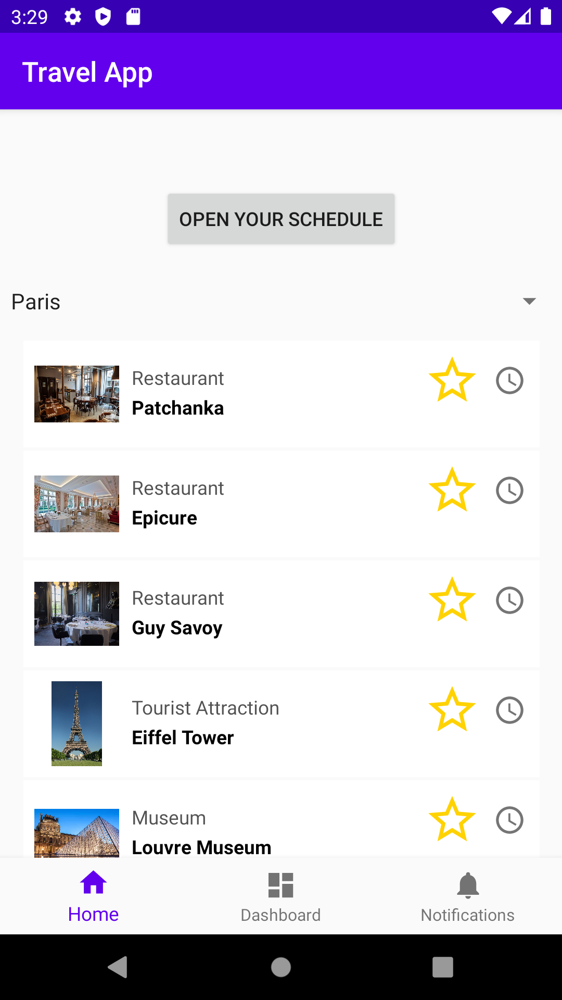
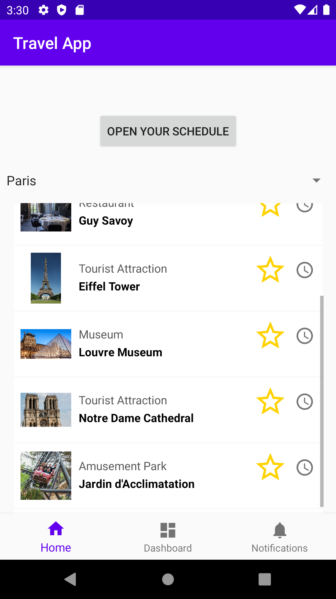

# TravelApp
TravelApp is an Android app which helps users plan their trip, discover new places to visit, and easily design a schedule that can be accessed even without Wifi. All of this is powered by simple to navigate UI that makes it easy for users to design their perfect trip.  Features that I also planned to add include a one-click way to call the local rideshare company (Uber in the US, Ola in India, or Cabify in Brazil for example). With one click, a cab can take you to the next location on your itinerary without you needing to manually enter the address into the rideshare app.

These are a few screenshots of what the app looks like right now.

Screenshots
-----------
 
 
 

